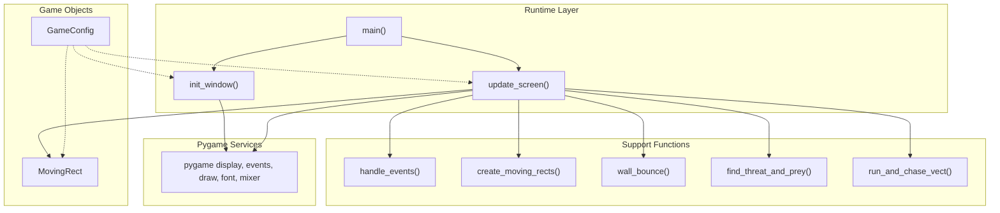
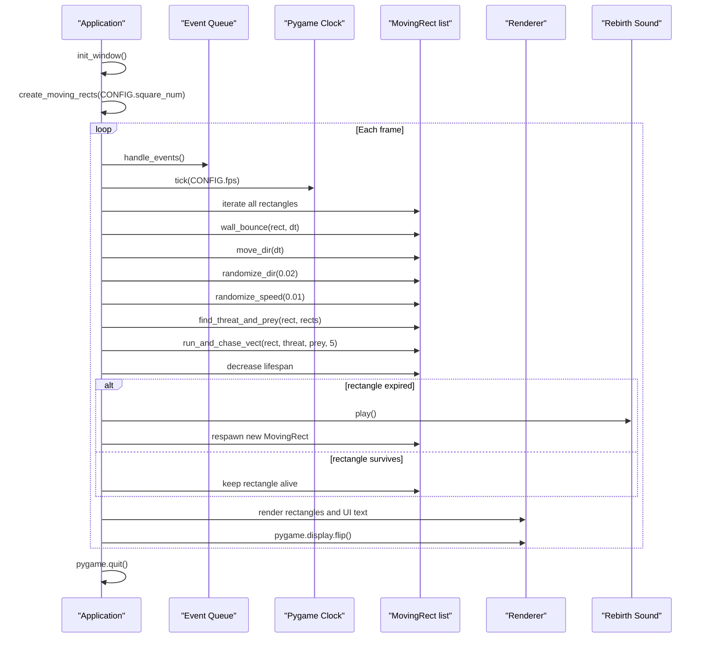
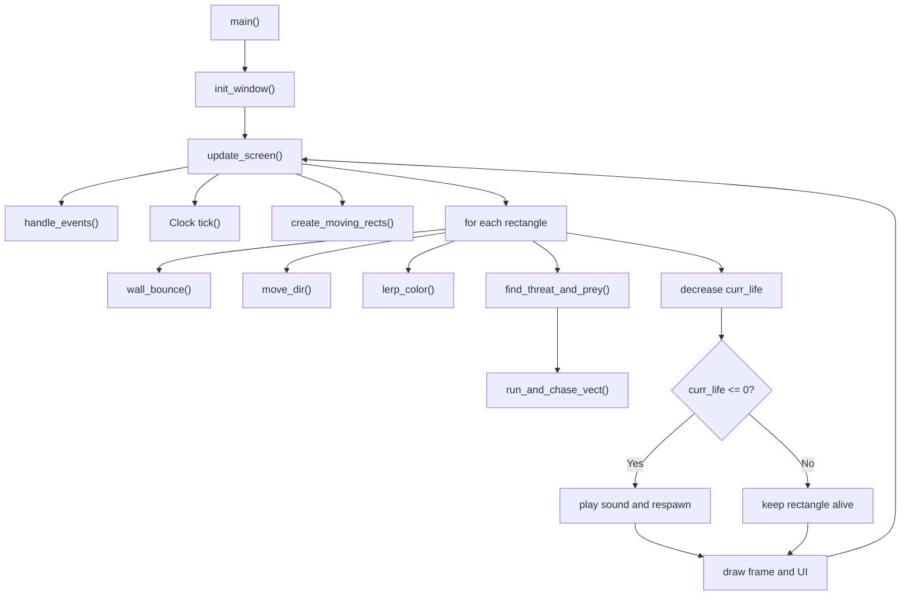
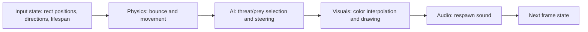

# Architecture Documentation: Moving Squares (Pygame)

## Overview

This project is a small Pygame simulation where colored rectangles move around the screen, bounce on walls, change direction over time, and use simple threat/prey logic to chase smaller rectangles while fleeing larger ones. Rectangles also fade from blue to red over their lifespan and respawn when they expire.

## Core Modules

- `main.py` contains the complete runtime.
- `GameConfig` stores window, timing, and spawn constants.
- `MovingRect` extends `pygame.rect.Rect` with movement, color, and lifespan behavior.
- `init_window()` sets up Pygame, the display, sound, font, and global state.
- `update_screen()` runs the main loop, updates rectangles, and renders the frame.

## System Architecture



## Main Game Loop



## Class Structure

```mermaid
classDiagram
    class "pygame.rect.Rect" {
        +x
        +y
        +width
        +height
        +centerx
        +centery
    }

    class "MovingRect" {
        +speed
        +vector
        +area
        +max_life
        +curr_life
        +color
        +set_speed() int
        +set_vector() pygame.Vector2
        +move_dir(dt) None
        +randomize_dir(chance) None
        +randomize_speed(chance) None
        +random_square() MovingRect
        +lerp_color(first, second, t) pygame.Color
    }

    class "GameConfig" {
        +width
        +height
        +fps
        +min_square_size
        +max_square_size
        +square_num
        +max_speed
    }

    "pygame.rect.Rect" <|-- "MovingRect"
```

## Control Flow



## Data Flow



## Behavior Summary

- Movement uses `dt` from the clock, so position updates are frame-scaled.
- `pygame.Vector2` stores direction, while speed is a scalar value.
- Threat/prey logic compares rectangle area and distance to choose the closest larger and smaller rectangles.
- Color fades from `START_COLOR` to `END_COLOR` using linear interpolation.
- Expired rectangles are removed and replaced immediately to keep the object count stable.

## Performance Notes

| Area | Observation |
|---|---|
| Frame update | Linear over the current rectangle list for movement and drawing. |
| Threat search | Quadratic overall because each rectangle scans the full list for prey and threats. |
| Rendering | Simple draw calls with no batching or caching layer. |
| Best optimization path | Spatial partitioning would reduce the cost of proximity checks. |

## Limitations and Extensions

The current implementation is intentionally simple: it keeps runtime state in globals, does not model collisions between rectangles, and uses full-list scans for threat detection. The easiest next step is to move steering constants into `GameConfig`; the largest scaling improvement would be a spatial grid or quadtree for neighbor lookup.
